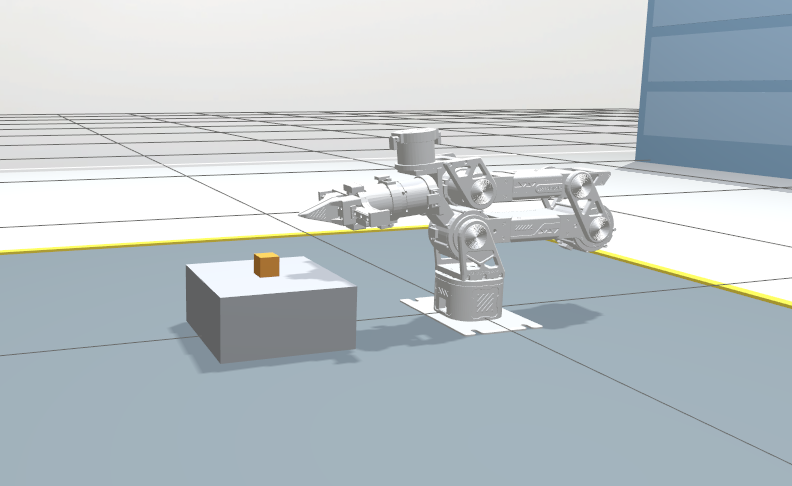

<h1 align="center">JoyReBot</h1>

## 项目简介

面向 **reBot B601-RS 六轴机械臂**的游戏手柄遥操作方案。通过手柄实现多种可靠的机械臂控制方式，同时采集操作数据，为动作复现、技能学习与遥操优化提供数据支撑。主要功能包括：

- Gazebo Harmonic 仿真环境与 ROS–Gazebo 话题桥接；
- Joy-Con 控制机械臂末端位姿和夹爪；
- 基于 URDF 运动学和数值 IK 的关节位置控制；
- 工作空间、关节限位、速度限制、输入超时和 IK 失败保护；
- 无手柄 Mock 测试与关节接口测试。

<p align="center">
  
</p>

## 环境要求

| 组件 | 版本/说明 |
| --- | --- |
| 操作系统 | Ubuntu 22.04 |
| ROS 2 | Humble |
| 仿真器 | Gazebo Harmonic（`gz-sim 8`） |
| 构建工具 | colcon |


## 快速开始

### 1. 构建

```bash
source /opt/ros/humble/setup.bash
colcon build --symlink-install
source install/setup.bash
```

### 2. 启动仿真

```bash
ros2 launch joyrebot_gazebo_sim sim.launch.py
```

无头模式（服务器或 SSH）：

```bash
ros2 launch joyrebot_gazebo_sim sim.launch.py gui:=false
```

### 3. 启动手柄遥操

另开一个终端，加载 ROS 环境和工作区后运行：

```bash
ros2 launch joyrebot_teleop teleop.launch.py
```

没有真实手柄时，可使用 Mock 输入验证遥操作链路：

```bash
ros2 launch joyrebot_teleop teleop.launch.py mock:=true
```

遥操作会读取 `/joint_states`，并发布 `/rebot/joint1/cmd_pos` 至 `/rebot/joint6/cmd_pos` 以及 `/rebot/gripper/cmd_pos`。关节单位为 rad，夹爪单位为 m。

## Joy-Con 操作

| 操作 | 功能 |
| --- | --- |
| 转动手柄 | 控制末端姿态 |
| 摇杆 | 控制末端平移 |
| 按下摇杆 | 控制末端下降 |
| `R` / `L` | 控制末端上升 |
| `ZR` / `ZL` | 切换夹爪开关状态 |
| `+` | 重新标定手柄 |
| `Home` | 平滑返回启动时的关节位置（左手柄使用 `Capture`） |

右手柄优先；未连接右手柄时可使用左手柄。遥操在关节反馈和手柄输入就绪后自动持续接合。启动时请将 Joy-Con 水平静置约两秒完成标定。

首次使用时请先在仿真中以小幅动作检查方向和限位。遥操作参数可在 [`src/joyrebot_teleop/config/teleop.yaml`](src/joyrebot_teleop/config/teleop.yaml) 中调整。

## 手动关节控制

仿真启动后，也可直接通过 ROS 2 话题发送关节命令：

```bash
# 控制关节（单位：rad）
ros2 topic pub --once /rebot/joint1/cmd_pos std_msgs/msg/Float64 '{data: 0.5}'

# 控制夹爪（单位：m，范围 0 ~ 0.05）
ros2 topic pub --once /rebot/gripper/cmd_pos std_msgs/msg/Float64 '{data: 0.03}'
```

## 测试

```bash
colcon test --packages-select joyrebot_gazebo_sim joyrebot_teleop
colcon test-result --verbose
```

仿真运行后，可检查关节和夹爪响应：

```bash
ros2 run joyrebot_gazebo_sim test_joints
```
